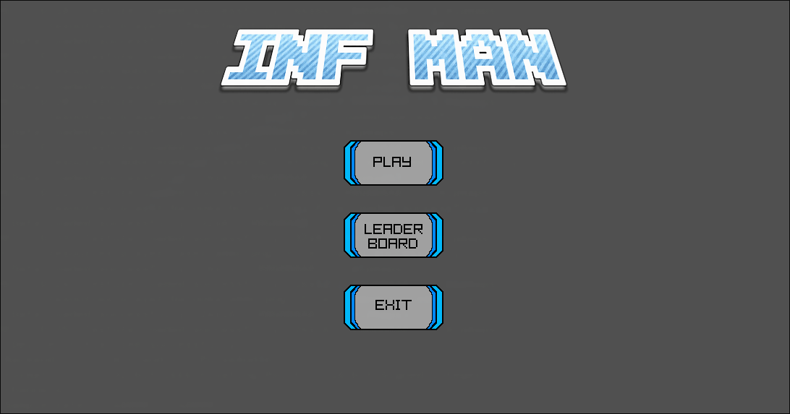

# The final project of INF01202: a Mega Man-based game: INFman

### The game may receive future updates, including:
- [ ] Less hardcoded button texts
- [ ] Drops (like when you kill an enemy)
- [ ] Different levels
- [ ] A way to progress

## How to build

If you have xmake installed, you can use:

    git clone https://github.com/Me1chi/infman.git
    cd infman
    xmake run

Also, using CMake:

    git clone https://github.com/Me1chi/infman.git
    cd infman
    mkdir build bin
    cd build
    cmake ..
    make
    cd ../bin
    ./infman

## Menu preview:

